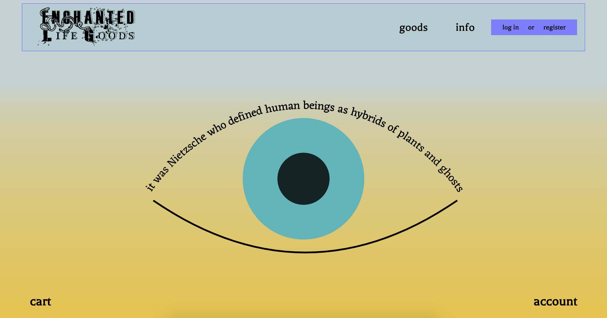
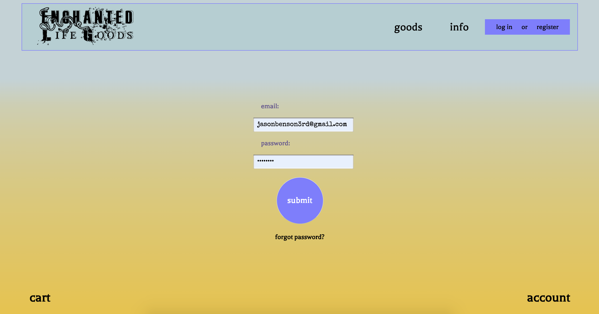
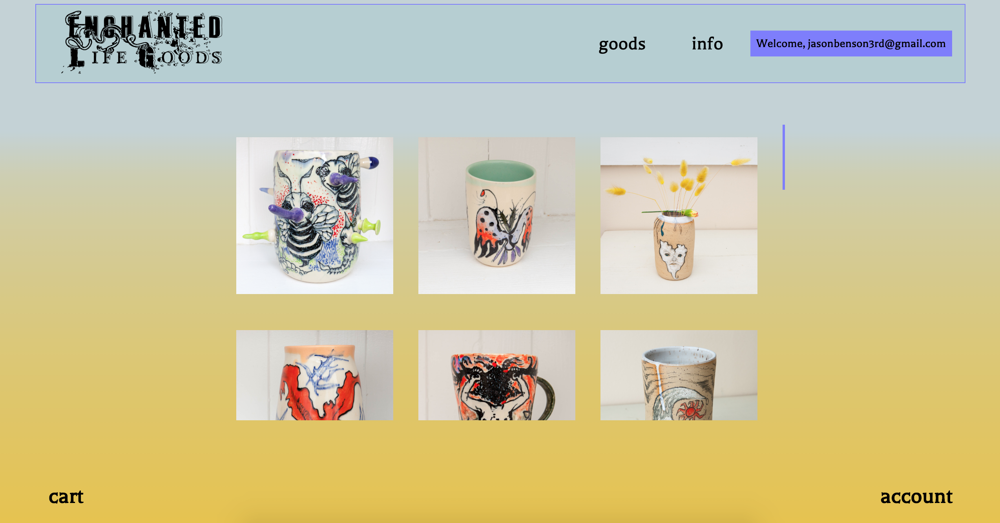
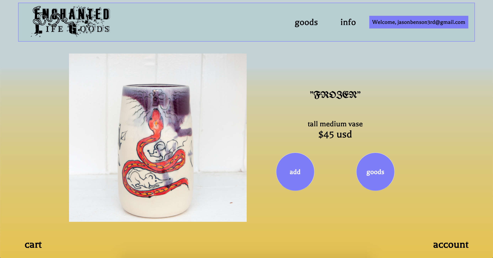
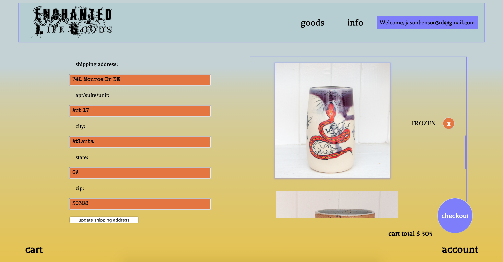
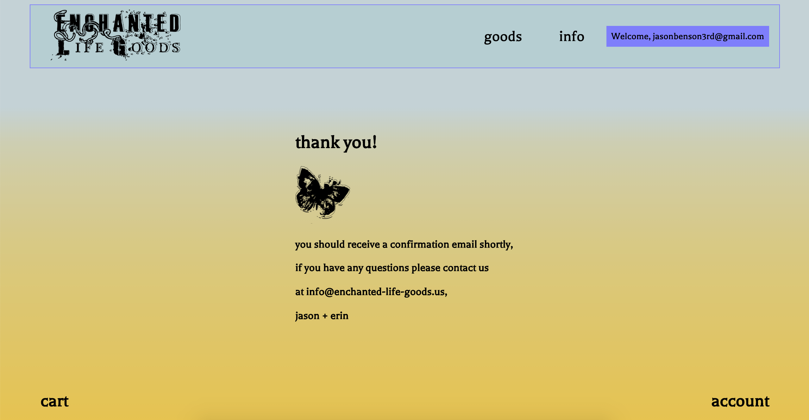

# enchantedLifeGoods

* Description
* Technologies
* Challenges and Solutions
* MVP

# Description
Enchanted Life Goods is an ecommerce site for a small business that I manage with my wife; primarily we make and sell ceramics. The site is designed to be playful and intuitive, and is pretty straightforward in terms of functionality. 

# Technologies
- CSS3
- JSX
- Node.js/Express
- PostgreSQL
- React/Redux

  
